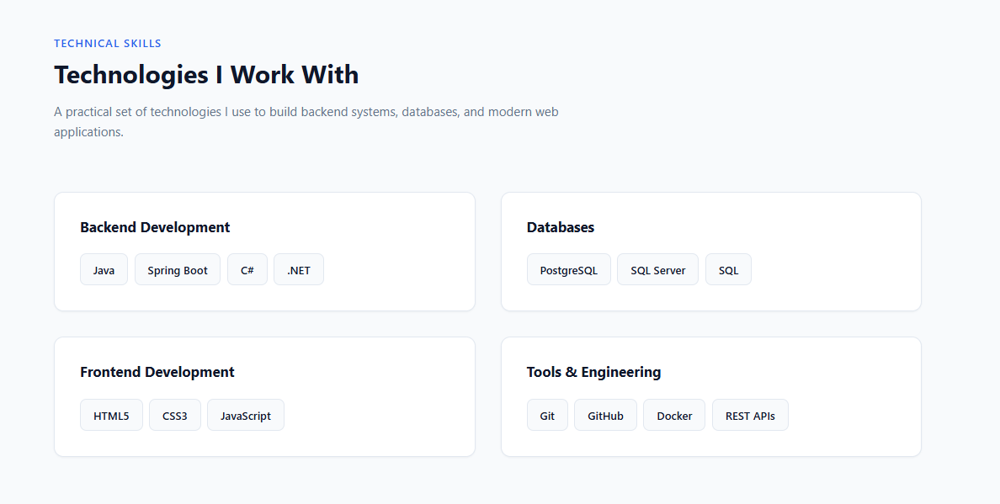

# Milestone Project 1 — Personal Portfolio

A professional personal portfolio website built to showcase my software engineering skills, projects, and technical experience.

## Sprint 1 — Project Foundation

### Completed

- Project structure
- HTML skeleton
- CSS design system
- CSS variables
- CSS reset
- Global styles
- Responsive container
- Navbar
- Footer
- Hero section structure
- Basic responsive layout

### Technologies

- HTML5
- CSS3
- CSS Variables
- Responsive Design

## Project Structure

```text
milestone-01-portfolio/
│
├── index.html
├── README.md
├── .gitignore
│
├── assets/
│   ├── images/
│   ├── icons/
│   └── screenshots/
│
└── css/
    ├── variables.css
    ├── reset.css
    ├── global.css
    ├── components.css
    └── main.css
```

# Sprint 2 — Hero + About

### Completed

Built the main personal introduction of the portfolio.

The goal of this sprint was to make the portfolio immediately communicate:

- Who I am
- What I do
- My main technical focus
- My education
- Where to find my professional profiles

---

### Hero Section

Implemented the main hero section containing:

- Professional role
- Main professional statement
- Short introduction
- Primary call-to-action
- Secondary call-to-action
- GitHub link
- LinkedIn link

The hero section is designed to communicate the purpose of the portfolio immediately when a visitor opens the website.

---

### CTA Buttons

Implemented two primary actions:

```text
View Projects
      ↓
Projects Section

Contact Me
      ↓
Contact Section
```

The buttons use reusable component styles from:

```text
css/components.css
```

This keeps button styling consistent throughout the application.

---

### Social Links

Added professional social links for:

- GitHub
- LinkedIn

External links use:

```html
target="_blank" rel="noopener noreferrer"
```

SVG icons are used instead of emoji to provide a cleaner and more professional visual appearance.

---

### About Section

Implemented the About section with information about:

- Software Engineering background
- Backend development focus
- Java
- Spring Boot
- Modern frontend technologies
- Software engineering interests

The section is intentionally concise so recruiters can quickly understand the technical direction of the portfolio.

---

### Education

Added an education section containing:

```text
Bachelor's Degree in Software Engineering
King Saud University
2022 — 2026
```

This provides the basic academic background directly within the portfolio.

---

### CSS Architecture

The CSS architecture was refined to maintain a clear separation between page structure and reusable components.

```text
css/
│
├── variables.css
│   └── Design tokens
│
├── reset.css
│   └── Browser reset
│
├── global.css
│   └── Global styles
│
├── components.css
│   ├── Buttons
│   ├── Theme toggle
│   └── Social links
│
└── main.css
    ├── Header
    ├── Navbar
    ├── Hero
    ├── Sections
    ├── About
    ├── Education
    └── Footer
```

The project follows the rule:

```text
main.css
    ↓
Page structure and layout

components.css
    ↓
Reusable UI components
```

This keeps the stylesheet organized as the portfolio grows.

---

### Responsive Design

The Hero section and CTA buttons were adapted for smaller screens.

Desktop:

```text
[ View Projects ] [ Contact Me ]
```

Mobile:

```text
[ View Projects ]

[ Contact Me ]
```

The existing responsive navbar behavior was also maintained.

---

### Sprint Result

The portfolio can now immediately communicate:

```text
Khaled Alawi
      ↓
Software Engineer
      ↓
Backend + Spring Boot
      ↓
Modern Frontend
      ↓
Projects
      ↓
Contact
```

The portfolio is now ready for the next major section:

```text
Sprint 3 — Skills
```

# Sprint 3 — Skills

### Completed

Implemented the **Skills section** to present technical skills in a structured and professional way.

The section is divided into skill categories, with individual technologies displayed as reusable technology cards.

---

## Skills Structure

The skills are organized into four categories:

```text
Skills
│
├── Backend Development
│   ├── Java
│   ├── Spring Boot
│   ├── C#
│   └── .NET
│
├── Databases
│   ├── PostgreSQL
│   ├── SQL Server
│   └── SQL
│
├── Frontend Development
│   ├── HTML5
│   ├── CSS3
│   └── JavaScript
│
└── Tools & Engineering
    ├── Git
    ├── GitHub
    ├── Docker
    └── REST APIs
```

---

## Features

### Skill Categories

Created separate categories for:

- Backend Development
- Databases
- Frontend Development
- Tools & Engineering

This makes the technical skills easier to scan and understand.

### Technology Cards

Each technology is displayed using a reusable card component.

Example:

```html
<div class="technology-card">
  <span class="technology-name">Java</span>
</div>
```

The same component is reused for all technologies.

### Responsive Layout

The skills section uses CSS Grid.

On larger screens:

```text
┌─────────────────┐  ┌─────────────────┐
│ Backend         │  │ Databases       │
└─────────────────┘  └─────────────────┘

┌─────────────────┐  ┌─────────────────┐
│ Frontend        │  │ Tools            │
└─────────────────┘  └─────────────────┘
```

On smaller screens, the categories become a single-column layout.

```text
┌────────────────────────────┐
│ Backend                    │
└────────────────────────────┘

┌────────────────────────────┐
│ Databases                  │
└────────────────────────────┘

┌────────────────────────────┐
│ Frontend                   │
└────────────────────────────┘

┌────────────────────────────┐
│ Tools                      │
└────────────────────────────┘
```

---

## CSS Architecture

The implementation continues to follow the project's CSS separation.

### `main.css`

Responsible for page and section layout:

```text
Skills Section
      │
      ├── section-heading
      │
      └── skills-grid
```

### `components.css`

Responsible for reusable UI components:

```text
skill-category
      │
      └── technology-list
              │
              └── technology-card
                      │
                      └── technology-name
```

This keeps layout responsibilities separate from reusable component styling.

---

## CSS Grid

The desktop layout uses two columns:

```css
.skills-grid {
  display: grid;
  grid-template-columns: repeat(2, 1fr);
  gap: var(--space-xl);
}
```

The layout changes to one column on smaller screens:

```css
@media (max-width: 768px) {
  .skills-grid {
    grid-template-columns: 1fr;
  }
}
```

---

## Component Styling

Skill categories use:

- Design-system spacing
- Border
- Border radius
- Background color
- Box shadow

Technology cards use:

- Flexible wrapping
- Consistent spacing
- Border
- Hover state
- Design-system variables

The implementation avoids hardcoded design values where reusable CSS variables are available.

---

## Responsive Behavior

The Skills section was tested for:

- Desktop
- Tablet
- Mobile

The two-column desktop layout becomes a single-column layout on smaller screens.

---

## JavaScript

No JavaScript was required for this sprint.

The Skills section is currently a static presentation of the developer's technical skills.

Future JavaScript functionality will be introduced only when required by later sprints.

---

## Sprint Result

The portfolio now communicates the developer's technical capabilities more clearly.

The page contains:

```text
Hero
  ↓
About
  ↓
Education
  ↓
Skills
  ├── Backend
  ├── Databases
  ├── Frontend
  └── Tools & Engineering
  ↓
Projects
  ↓
Contact
```

The Skills section is now ready for future portfolio improvements.

---

# Screenshots

## Skills Section


