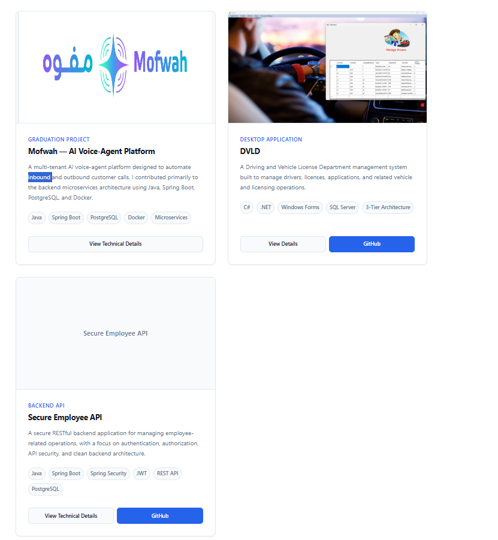
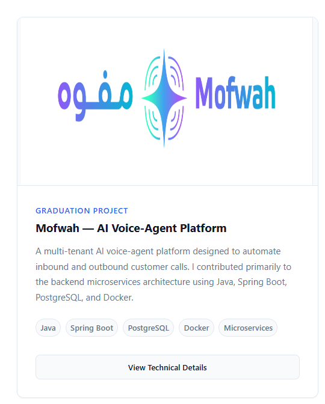
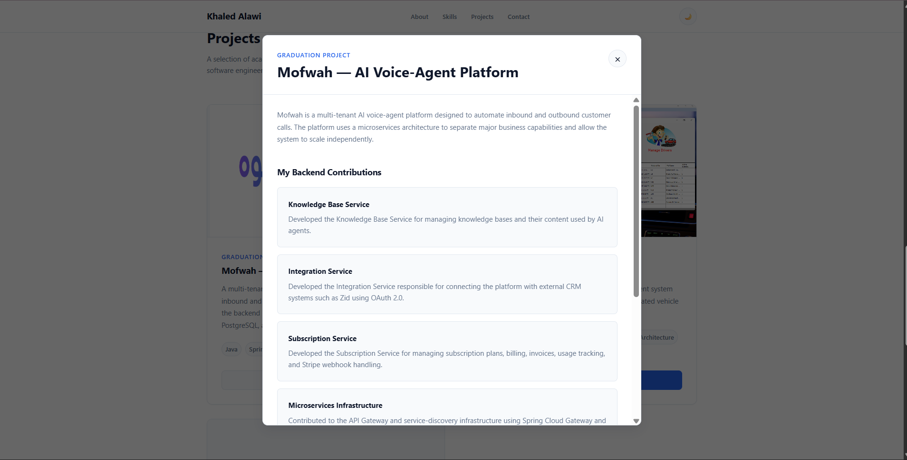
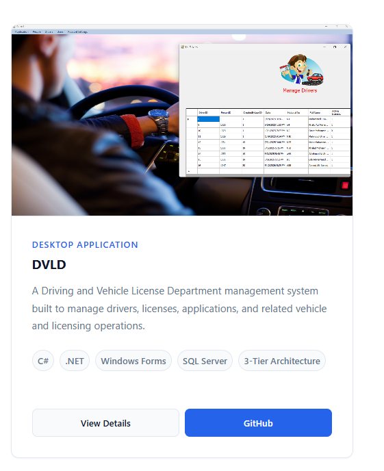
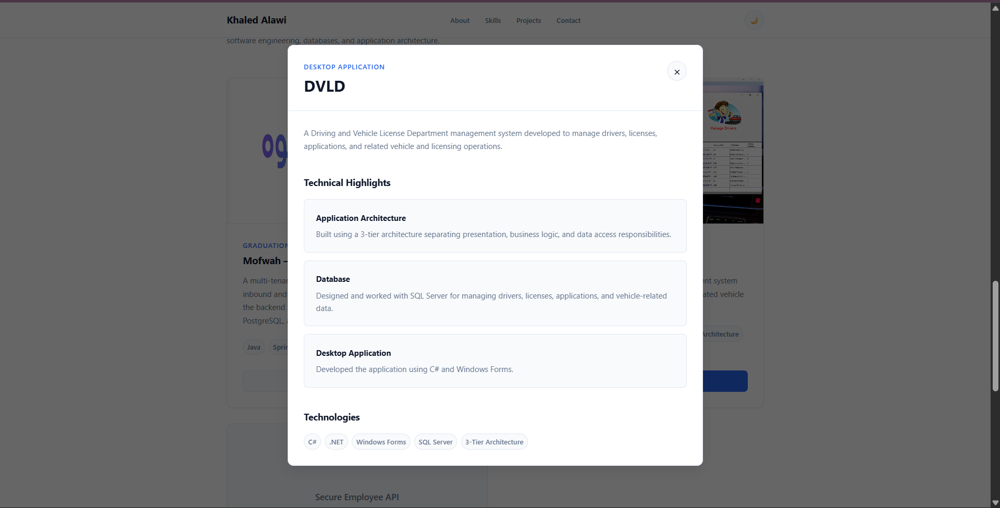

# Milestone Project 1 — Personal Portfolio

A professional personal portfolio website built to showcase my software engineering skills, projects, and technical experience.

## Sprint 1 — Project Foundation

### Completed

- Project structure
- HTML skeleton
- CSS design system
- CSS variables
- CSS reset
- Global styles
- Responsive container
- Navbar
- Footer
- Hero section structure
- Basic responsive layout

### Technologies

- HTML5
- CSS3
- CSS Variables
- Responsive Design

## Project Structure

```text
milestone-01-portfolio/
│
├── index.html
├── README.md
├── .gitignore
│
├── assets/
│   ├── images/
│   ├── icons/
│   └── screenshots/
│
└── css/
    ├── variables.css
    ├── reset.css
    ├── global.css
    ├── components.css
    └── main.css
```

# Sprint 2 — Hero + About

### Completed

Built the main personal introduction of the portfolio.

The goal of this sprint was to make the portfolio immediately communicate:

- Who I am
- What I do
- My main technical focus
- My education
- Where to find my professional profiles

---

### Hero Section

Implemented the main hero section containing:

- Professional role
- Main professional statement
- Short introduction
- Primary call-to-action
- Secondary call-to-action
- GitHub link
- LinkedIn link

The hero section is designed to communicate the purpose of the portfolio immediately when a visitor opens the website.

---

### CTA Buttons

Implemented two primary actions:

```text
View Projects
      ↓
Projects Section

Contact Me
      ↓
Contact Section
```

The buttons use reusable component styles from:

```text
css/components.css
```

This keeps button styling consistent throughout the application.

---

### Social Links

Added professional social links for:

- GitHub
- LinkedIn

External links use:

```html
target="_blank" rel="noopener noreferrer"
```

SVG icons are used instead of emoji to provide a cleaner and more professional visual appearance.

---

### About Section

Implemented the About section with information about:

- Software Engineering background
- Backend development focus
- Java
- Spring Boot
- Modern frontend technologies
- Software engineering interests

The section is intentionally concise so recruiters can quickly understand the technical direction of the portfolio.

---

### Education

Added an education section containing:

```text
Bachelor's Degree in Software Engineering
King Saud University
2022 — 2026
```

This provides the basic academic background directly within the portfolio.

---

### CSS Architecture

The CSS architecture was refined to maintain a clear separation between page structure and reusable components.

```text
css/
│
├── variables.css
│   └── Design tokens
│
├── reset.css
│   └── Browser reset
│
├── global.css
│   └── Global styles
│
├── components.css
│   ├── Buttons
│   ├── Theme toggle
│   └── Social links
│
└── main.css
    ├── Header
    ├── Navbar
    ├── Hero
    ├── Sections
    ├── About
    ├── Education
    └── Footer
```

The project follows the rule:

```text
main.css
    ↓
Page structure and layout

components.css
    ↓
Reusable UI components
```

This keeps the stylesheet organized as the portfolio grows.

---

### Responsive Design

The Hero section and CTA buttons were adapted for smaller screens.

Desktop:

```text
[ View Projects ] [ Contact Me ]
```

Mobile:

```text
[ View Projects ]

[ Contact Me ]
```

The existing responsive navbar behavior was also maintained.

---

### Sprint Result

The portfolio can now immediately communicate:

```text
Khaled Alawi
      ↓
Software Engineer
      ↓
Backend + Spring Boot
      ↓
Modern Frontend
      ↓
Projects
      ↓
Contact
```

The portfolio is now ready for the next major section:

```text
Sprint 3 — Skills
```

# Sprint 3 — Skills

### Completed

Implemented the **Skills section** to present technical skills in a structured and professional way.

The section is divided into skill categories, with individual technologies displayed as reusable technology cards.

---

## Skills Structure

The skills are organized into four categories:

```text
Skills
│
├── Backend Development
│   ├── Java
│   ├── Spring Boot
│   ├── C#
│   └── .NET
│
├── Databases
│   ├── PostgreSQL
│   ├── SQL Server
│   └── SQL
│
├── Frontend Development
│   ├── HTML5
│   ├── CSS3
│   └── JavaScript
│
└── Tools & Engineering
    ├── Git
    ├── GitHub
    ├── Docker
    └── REST APIs
```

---

## Features

### Skill Categories

Created separate categories for:

- Backend Development
- Databases
- Frontend Development
- Tools & Engineering

This makes the technical skills easier to scan and understand.

### Technology Cards

Each technology is displayed using a reusable card component.

Example:

```html
<div class="technology-card">
  <span class="technology-name">Java</span>
</div>
```

The same component is reused for all technologies.

### Responsive Layout

The skills section uses CSS Grid.

On larger screens:

```text
┌─────────────────┐  ┌─────────────────┐
│ Backend         │  │ Databases       │
└─────────────────┘  └─────────────────┘

┌─────────────────┐  ┌─────────────────┐
│ Frontend        │  │ Tools            │
└─────────────────┘  └─────────────────┘
```

On smaller screens, the categories become a single-column layout.

```text
┌────────────────────────────┐
│ Backend                    │
└────────────────────────────┘

┌────────────────────────────┐
│ Databases                  │
└────────────────────────────┘

┌────────────────────────────┐
│ Frontend                   │
└────────────────────────────┘

┌────────────────────────────┐
│ Tools                      │
└────────────────────────────┘
```

---

## CSS Architecture

The implementation continues to follow the project's CSS separation.

### `main.css`

Responsible for page and section layout:

```text
Skills Section
      │
      ├── section-heading
      │
      └── skills-grid
```

### `components.css`

Responsible for reusable UI components:

```text
skill-category
      │
      └── technology-list
              │
              └── technology-card
                      │
                      └── technology-name
```

This keeps layout responsibilities separate from reusable component styling.

---

## CSS Grid

The desktop layout uses two columns:

```css
.skills-grid {
  display: grid;
  grid-template-columns: repeat(2, 1fr);
  gap: var(--space-xl);
}
```

The layout changes to one column on smaller screens:

```css
@media (max-width: 768px) {
  .skills-grid {
    grid-template-columns: 1fr;
  }
}
```

---

## Component Styling

Skill categories use:

- Design-system spacing
- Border
- Border radius
- Background color
- Box shadow

Technology cards use:

- Flexible wrapping
- Consistent spacing
- Border
- Hover state
- Design-system variables

The implementation avoids hardcoded design values where reusable CSS variables are available.

---

## Responsive Behavior

The Skills section was tested for:

- Desktop
- Tablet
- Mobile

The two-column desktop layout becomes a single-column layout on smaller screens.

---

## JavaScript

No JavaScript was required for this sprint.

The Skills section is currently a static presentation of the developer's technical skills.

Future JavaScript functionality will be introduced only when required by later sprints.

---

## Sprint Result

The portfolio now communicates the developer's technical capabilities more clearly.

The page contains:

```text
Hero
  ↓
About
  ↓
Education
  ↓
Skills
  ├── Backend
  ├── Databases
  ├── Frontend
  └── Tools & Engineering
  ↓
Projects
  ↓
Contact
```

The Skills section is now ready for future portfolio improvements.

---

# Screenshots

## Skills Section


# Sprint 4 — Portfolio Projects & Interactive Project Details

## Overview

Sprint 4 focused on building the Projects section of the portfolio and introducing the first JavaScript interactions into the project.

The goal was to present selected projects professionally while keeping the portfolio structure clean, responsive, and easy to extend.

This sprint was larger than the previous sprints because it introduced:

- Project cards
- Project screenshots and logos
- Technology badges
- Project-specific GitHub links
- Detailed project information
- Native HTML `<dialog>` elements
- JavaScript event handling
- ES modules
- `data-*` attributes
- Responsive project layouts
- Modal/backdrop interactions
- Defensive JavaScript error handling

---

# Sprint Goals

The main goals of Sprint 4 were:

- Build a professional Projects section.
- Create reusable project-card styling.
- Present important projects consistently.
- Highlight the graduation project, Mofwah.
- Provide more technical information without making the project cards too large.
- Introduce interactive project details using native HTML dialogs.
- Keep JavaScript separated into modules.
- Make the Projects section responsive.
- Connect projects to their GitHub repositories where available.

---

# Projects Included

The portfolio currently presents the following projects:

## 1. Mofwah — AI Voice-Agent Platform

**Type:** Graduation Project

Mofwah is a multi-tenant AI voice-agent platform designed to automate inbound and outbound customer calls.

My primary contribution was on the backend side, where I worked on several microservices and backend infrastructure.

### Backend Contributions

#### Knowledge Base Service

Developed the Knowledge Base Service for managing knowledge bases and their content used by AI agents.

#### Integration Service

Developed the Integration Service for connecting the platform with external CRM systems such as Zid using OAuth 2.0.

#### Subscription Service

Developed the Subscription Service for managing subscription plans, billing, invoices, usage tracking, and Stripe webhook handling.

#### Microservices Infrastructure

Contributed to the API Gateway and service-discovery infrastructure using:

- Spring Cloud Gateway
- Eureka

#### REST APIs & Persistence

Implemented RESTful APIs with PostgreSQL persistence using:

- Spring Data JPA
- Hibernate

#### Multi-Tenant Security

Applied multi-tenant data isolation and security through authenticated service requests.

### Technologies

- Java
- Spring Boot
- Spring Security
- OAuth 2.0
- JWT
- PostgreSQL
- Redis
- JPA / Hibernate
- Flyway
- Docker
- Eureka
- Spring Cloud Gateway
- OpenAPI / Swagger
- JUnit
- Mockito

### Project Presentation

The main project card intentionally contains only a concise description.

The detailed backend contribution information is displayed through the **View Technical Details** dialog.

This keeps the project card readable while still allowing recruiters or developers to explore the technical implementation.

---

## 2. DVLD

**Type:** Desktop Application

A Driving and Vehicle License Department management system built to manage:

- Drivers
- Licenses
- Applications
- Vehicle-related operations
- Licensing operations

### Technologies

- C#
- .NET
- Windows Forms
- SQL Server
- 3-Tier Architecture

The project also includes a dedicated project-details dialog containing additional technical information.

---

## 3. Secure Employee API

**Type:** Backend / REST API

A backend API project focused on building a secure employee-management REST API.

### Repository

[Secure Employee API](https://github.com/KhaledAlawi100/secure-employee-api)

The project demonstrates backend development using Java and Spring Boot with a focus on API development and security.

---

# Project Card Design

Each project follows a consistent card structure.

```text
┌──────────────────────────────────────┐
│                                      │
│          Project Image / Logo        │
│                                      │
├──────────────────────────────────────┤
│ Project Type                         │
│                                      │
│ Project Name                         │
│                                      │
│ Short Project Description             │
│                                      │
│ Technology  Technology  Technology   │
│ Technology  Technology               │
│                                      │
│ [ View Details ] [ GitHub ]          │
└──────────────────────────────────────┘
```

# Sprint 4 — Final Screenshots

The following screenshots show the final implementation completed during Sprint 4.

## Projects Section

The Projects section presents the selected projects using a consistent card layout.

Each card includes:

- Project image or logo
- Project type
- Project name
- Short description
- Technology badges
- Project details button
- GitHub link



---

## Mofwah Project

The Mofwah project is highlighted as the graduation project.

The card uses the Mofwah project logo and provides a concise overview of the project while keeping the detailed backend contributions inside a separate dialog.



---

## Mofwah Technical Details

The **View Technical Details** button opens a native HTML `<dialog>` containing additional information about my backend contributions.

The dialog presents:

- Project overview
- Knowledge Base Service
- Integration Service
- Subscription Service
- Microservices infrastructure
- REST APIs and persistence
- Multi-tenant security
- Technologies used



---

## DVLD Project

The DVLD project follows the same project-card structure to keep the portfolio visually consistent.



---

## DVLD Technical Details

The DVLD technical information is displayed through the same dialog-based interaction used by the Mofwah project.

This keeps the project cards compact while still allowing additional technical information to be viewed when needed.



---

# Sprint 5 — Dark Mode

## Overview

Sprint 5 focused on implementing a complete theme-switching system for the
portfolio website.

The goal was to move from a static visual design to a user-controlled theme
system while keeping the implementation simple, reusable, and maintainable.

The theme system supports:

- Light theme
- Dark theme
- Theme toggle button
- CSS variables
- JavaScript state management
- `localStorage`
- Persisted theme preference
- Theme persistence after page refresh

---

## Sprint Goal

> Practice state management and browser storage by implementing a persistent
> light/dark theme system.

---

## Features Implemented

### 1. Theme Toggle

Added a theme toggle button to the main navigation.

The button allows the user to switch between:

- Light mode
- Dark mode

The toggle uses an SVG icon instead of an emoji to keep the interface
consistent with the rest of the portfolio.

---

### 2. Light Theme

The default theme uses the existing light color system.

The colors are controlled through CSS custom properties rather than being
hardcoded throughout the stylesheet.

Example:

```css
:root {
  --color-background: #ffffff;
  --color-background-alt: #f8fafc;
  --color-text: #111827;
  --color-text-secondary: #6b7280;
  --color-border: #e5e7eb;
}
```

## Sprint 6 — Contact Form ✅

Implemented a complete contact form with real backend integration.

### Features

- Contact form UI
- Semantic form structure
- Client-side validation
- Backend validation
- Field-level error messages
- Success state
- Error state
- Loading state
- Accessible form labels
- Accessible status messages
- Form reset after successful submission
- Real API communication using `fetch()`
- Spring Boot email service integration
- Real email delivery

### Architecture

```text
Frontend
   ↓
Client-side Validation
   ↓
fetch()
   ↓
Spring Boot REST API
   ↓
Backend Validation
   ↓
Email Service
   ↓
Email
